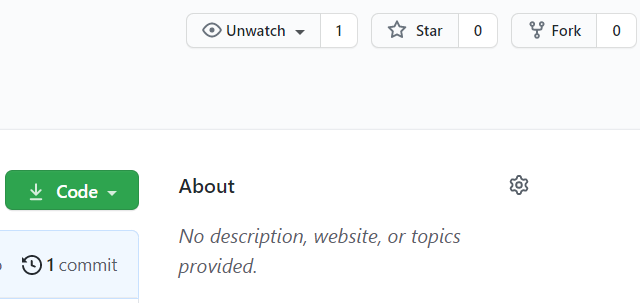
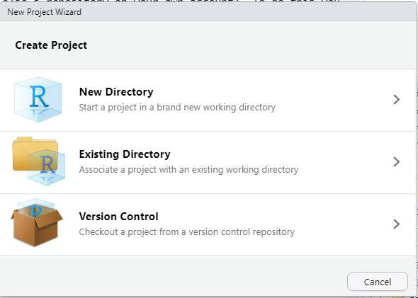
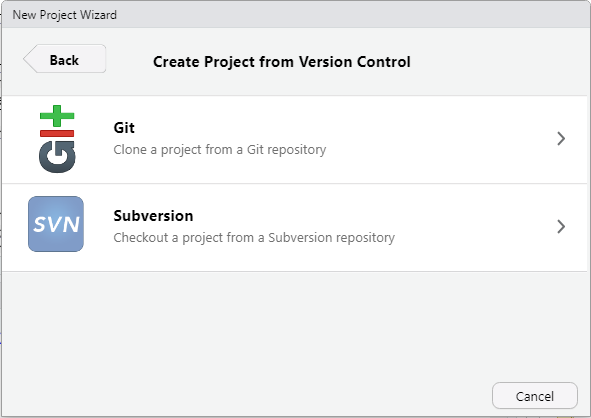
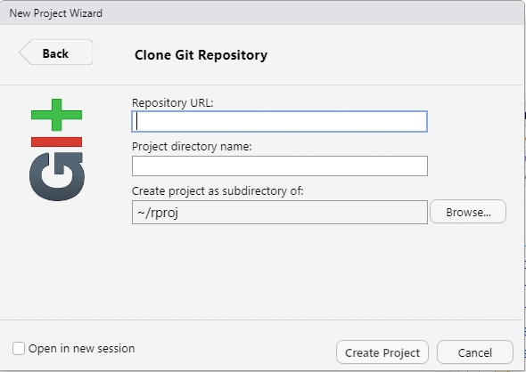
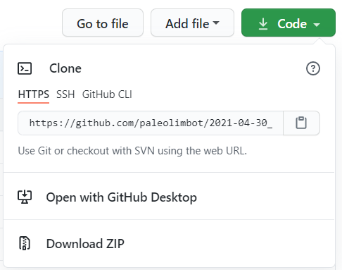

# 2021-04-30 R Learning and Development Git/GitHub practice

Today's exercise is a collection of common actions for using Git and GitHub from RStudio. The actions we will practice are:

- **Fork** a repository (make a copy of somebody else's repository on your own account). To do this you will need to [create a GitHub account](https://github.com/join) if you haven't already.
- **Clone** a repository (make a local copy of a GitHub repository on your computer so you can edit the files). Do to this you will need to [install Git](https://happygitwithr.com/install-git.html#install-git-windows) if you haven't already and make sure RStudio knows that Git exists on your system.
- **Commit** a change to one or more files in the repository.
- **Push** your changes back to GitHub. This includes [setting up RStudio to talk to GitHub](https://happygitwithr.com/credential-caching.html#how-to-get-a-pat) if you haven't already!

## Fork

In order to practice using Git/GitHub, you will need a repository to work from! You could [create a blank new repository to work with](https://github.com/new) but I think it's more exciting to start with a repo that has some content. You can use this one! To get started, click the "Fork" button at the top of this page. To do this you will need to [create a GitHub account](https://github.com/join) if you haven't already (you'll be prompted to create one or sign in when you click "fork").

## Clone

Once you have your own repository, (i.e., the address of the repository should be https://github.com/YOUR_USER_NAME/2021-04-30_dfo-git), you will need to **clone** the repository to your own computer to make changes in RStudio. From RStudio, click on *New Project* at the top right hand of the window. You should see a screen that looks like this:

If you don't see *Version Control* as a third option, you probably haven't installed Git. There are excellent instructions for installing git in [Chapter 4 of Happy Git With R by Jenny Bryan](https://happygitwithr.com/install-git.html#install-git-windows). You'll have to restart RStudio after installing Git and you should see the *Version Control* option. Click on *Version Control* and you should see a screen that looks like this:

Click on *Git* and you should see a screen that looks like this:

The *Repository URL* you need is located on your GitHub repository page under the green *Code* button. Unless you know what SSH is and have it set up on your computer already, **make sure you have *HTTPS* selected**. Click the little clipboard icon to copy the value to your clipboard.

Paste the value under *Repository URL* and click *Create Project*.

## Commit

Open *argo-report.Rmd* and follow the instructions at the top of the page. Click on the *Git* tab at the top right of the RStudio window.
