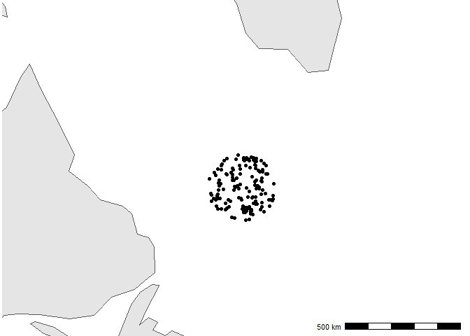
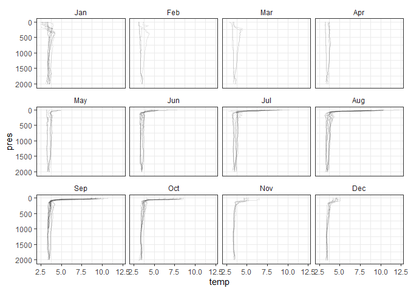
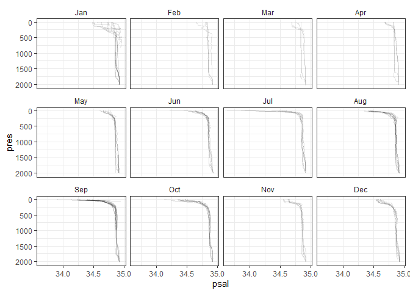

When you’ve opened this document, remove this text and click “Knit”
above to re-render the document\! You may have to install one or more
packages to re-render the document.

If you’re already good at this, see if you can modify the code below to
be less repetitive\! There are two plots that are essentially identical
that *could* be extracted into a single function.

``` r
prof_meta <- read.csv("argo_profile_meta.csv")
prof <- read.csv("argo_profiles.csv")
countries <- ne_countries(returnclass = "sf")
```

``` r
ggplot(prof_meta) +
  annotation_spatial(countries) +
  shadow_spatial(
    st_bbox(
      c(xmin = -65, xmax = -35, ymin = 50, ymax = 62),
      crs = 4326
    ),
  ) +
  geom_spatial_point(aes(longitude, latitude), crs = 4326) +
  annotation_scale(location = "br") +
  coord_sf(crs = 3857) +
  theme_void()
```

<!-- -->

``` r
ggplot(prof, aes(y = pres, x = temp)) +
  geom_line(
    aes(group = interaction(file, n_prof)),
    orientation = "y",
    alpha = 0.1
  ) +
  facet_wrap(vars(month(date, label = TRUE)), nrow = 3) +
  scale_y_reverse() +
  theme_bw() +
  theme(strip.background = element_blank())
```

<!-- -->

``` r
ggplot(prof, aes(y = pres, x = psal)) +
  geom_line(
    aes(group = interaction(file, n_prof)),
    orientation = "y",
    alpha = 0.1
  ) +
  facet_wrap(vars(month(date, label = TRUE)), nrow = 3) +
  scale_y_reverse() +
  theme_bw() +
  theme(strip.background = element_blank())
```

<!-- -->
